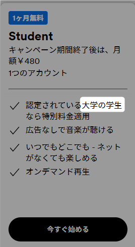
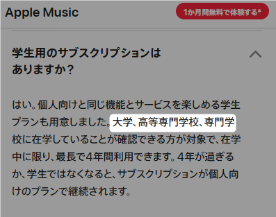
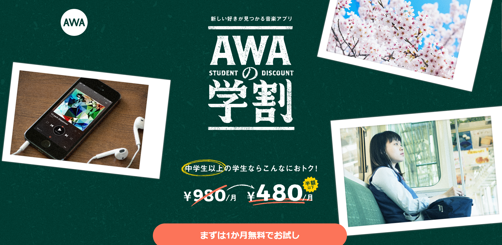
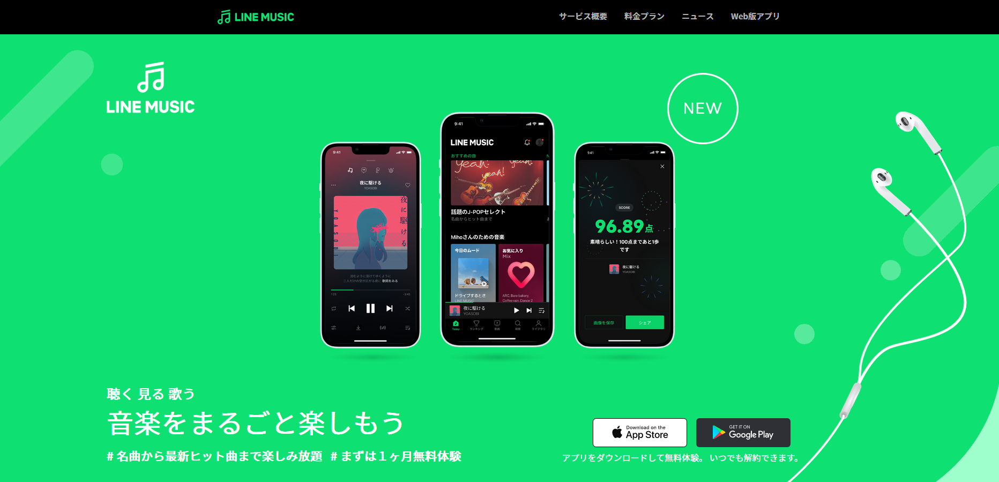
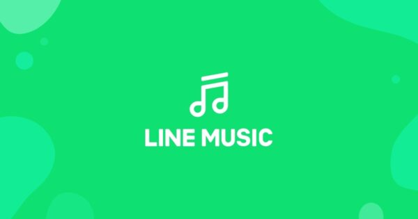
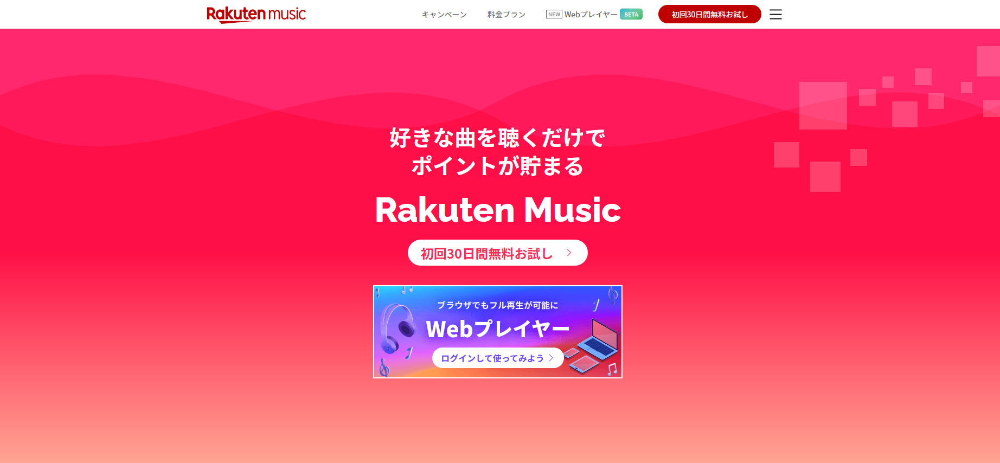

悩める学生

Apple MusicもSpotifyも学割使えないんだけど！！！

悩める学生

そんなあなたに、中高生でも学割が使えるサブスクを紹介するよ！

世はまさに大サブスク時代！！  
使いやすいSpotify、音質が良いAmazon MusicやApple Musicなど様々な音楽サブスクが溢れていています。

さらにそのほとんどのサービスでは「学割プラン」があり、一般プランの半額ほどでサービスを利用することができます。

**しかし！！**

引用元：Spotify [https://www.spotify.com/jp/premium/](https://www.spotify.com/jp/premium/)

引用元：AppleMusic [https://www.apple.com/jp/apple-music/](https://www.apple.com/jp/apple-music/)

**中高生対象外やんけ！！！**

そうなんです。初めに挙げたような、有名な海外のサービスは在学証明のシステムの関係なのか**中高生は学割の対象になりません**。

そこで今回は中高生でも学割が適用される音楽サブスクサービスをご紹介します！！

## AWA

<figure>

<figcaption>

引用元：AWAの学割 | 中学生以上の学生なら月額480円で音楽が聴き放題！ [https://info.awa.fm/student\_discount/](https://info.awa.fm/student_discount/)

</figcaption>

</figure>

<table class="has-border-color has-var-sgb-main-color-border-color"><tbody><tr><td class="has-text-align-center" data-align="center">学割料金</td><td>480円</td></tr><tr><td class="has-text-align-center" data-align="center">最高音質</td><td>320kbps</td></tr><tr><td class="has-text-align-center" data-align="center">楽曲数</td><td>1億2000万曲</td></tr><tr><td class="has-text-align-center" data-align="center">その他機能</td><td>・歌詞表示 ・オフライン再生 ・<strong>コメント機能</strong> ・曲検索、<strong>画像から歌詞</strong></td></tr></tbody></table>

### 機能盛りだくさん

AWAの特徴はコメント機能やアーティストによるライブなど、みんなでコミュニケーションを取りながら音楽を楽しめること、歌詞が動く「LYRIC DIVE」機能など、**遊び心満点で楽しく音楽が聴ける**という点です。

写真を選択するとその雰囲気にあった曲を探してくれたり、SpotifyのようにAWAユーザーの人たちがつくったプレイリストがわかりやすく表示されたり、1億2000万曲という音楽サブスク界でもトップの楽曲数を誇ることなど、**新たな曲にどんどん出会いたい人にはとてもおすすめ**できるサービスです。

また個人的に重要なポイントとしてPC版のアプリがあるという点もクリアしていてもし自分が中高生だったらAWAを選んでいると思うほどよいサービスだと感じました。

気になった点は、丸い再生バーは正直使いづらかったです。これは個人差もあるとおもうので。無料体験を是非してみてください！

1ヶ月無料！

[

参考

AWAの学割 | 中学生以上の学生なら月額480円で音楽が聴き放題！

AWA

](https://info.awa.fm/student_discount/)

## LINE MUSIC

<figure>

<figcaption>

引用元：LINE MUSIC [https://music.line.me/about/](https://music.line.me/about/)

</figcaption>

</figure>

<table class="has-border-color has-var-sgb-main-color-border-color"><tbody><tr><td class="has-text-align-center" data-align="center">学割料金</td><td>480円（LINE STORE経由の場合）</td></tr><tr><td class="has-text-align-center" data-align="center">最高音質</td><td>320kbps</td></tr><tr><td class="has-text-align-center" data-align="center">楽曲数</td><td>9000万曲</td></tr><tr><td class="has-text-align-center" data-align="center">その他機能</td><td>・歌詞表示（<strong>同期対応</strong>） ・オフライン再生 ・カラオケ機能 ・LINE連携機能 ・ミュージックビデオが観られる<strong>歌詞</strong></td></tr></tbody></table>

### 本格カラオケ機能あり！

LINE MUSICの特徴はなんといってもLINEとの連携機能！プロフィール曲や着・発信音を月に何回でも変えられるようになったり、友だちが設定している曲をそのままフルで聴くこともできます。

また**採点もできるカラオケ機能**や歌詞が一文字ずつ同期される機能など、一緒に歌いながら聴きたい人には最高のサブスクだと感じました！

個人的には**UIがとても美しく**て歌詞もApple MusicやSpotifyのように見やすかったのがとても魅力的でした。

気になったポイントはPCは機能が少なく使いづらかったことです。また今回紹介するサブスクの中では曲数は一番少ないです。ただ、マニアックな洋楽を聴く！とかではない限りなにも変わらないと思うので**曲数は無視して選んでもOK**だと思います。

#まずは１ヶ月無料体験

[

参考

LINE MUSIC

](https://music.line.me/about/)

## 楽天ミュージック（高校生～）

<figure>

<figcaption>

引用元：楽天ミュージック | 楽天の音楽サブスク、1億曲以上が聴き放題 [https://music.rakuten.co.jp/](https://music.rakuten.co.jp/)

</figcaption>

</figure>

<table class="has-border-color has-var-sgb-main-color-border-color"><tbody><tr><td class="has-text-align-center" data-align="center">学割料金</td><td>480円（LINE STORE経由の場合）</td></tr><tr><td class="has-text-align-center" data-align="center">最高音質</td><td>320kbps</td></tr><tr><td class="has-text-align-center" data-align="center">楽曲数</td><td>1億曲</td></tr><tr><td class="has-text-align-center" data-align="center">その他機能</td><td>・歌詞表示（<strong>同期対応</strong>） ・オフライン再生 ・<strong>曲を聴くとポイントが貯まる</strong></td></tr></tbody></table>

### 聴くだけでポイントが貯まる

楽天ミュージックは曲を聴くと**1日1ポイントずつ楽天ポイントが溜まっていくこと**です！学割で安くなっているのに更にお得になるのはとても魅力的です。もちろん支払いにも楽天ポイントが使えます。

また歌詞の同期機能や利用日数に応じてクーポンやプレゼント企画に応募できるプログラムもあります。

注意点としては楽天ミュージックの学割は**高校生からなので中学生は利用できません**。中学生はLINE MUSICかAWAを契約しましょう！

30日お試し！

[

参考

楽天ミュージック | 学生プラン

楽天ミュージック

](https://music.rakuten.co.jp/plan/student/)

## まとめ

いかがでしたでしょうか？どのサービスもSpotifyなどの海外のサブスクには無い個性あふれる機能があったことがわかっていただけたと思います。

基本的なポイントである音質や価格はすべて同じで、曲数も大差なく、無料体験もあるのでまずは全て使ってみて気に入ったサービスを契約すれば良いと思います。

参考程度に、りーむ（筆者）のおすすめはPCでも聴くならAWA、スマホだけしか使わない人はLINE MUSICを契約しておけば間違いないと思います！
