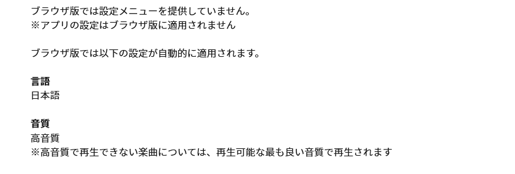

<figure>

<figcaption>

引用元:[ヘルプセンター | LINE MUSIC](https://help2.line.me/LINEMusic/web/pc?lang=ja&contentId=20018777)

</figcaption>

</figure>

以上です！ｗ

今回はPCでも聴けるLINE MUSICのWEB版（ブラウザ版）での音質が気になったので調べてみたらヘルプページに普通にのってたので共有します（しました）

## 高音質とは

まずスマホアプリ版のLINE MUSICはAAC形式で配信されており音質は以下の様になっています。

<table><tbody><tr><td>高音質</td><td>320Kbps</td></tr><tr><td>中音質</td><td>192Kbps</td></tr><tr><td>低音質</td><td>AAC</td></tr></tbody></table>

ということなので、おそらくWEB版も320kbpsなんだとおもいます。

## まとめ

ということで今回はLINE MUSICのWEB版の音質についてご紹介しました！  
WEB版はリニューアルする前まではおまけというか一応作ってます感があったのですが、リニューアルされてからアプリ版にも負けないような機能性なのでぜひ皆さんも使ってみてください！

また中高生でも学割が適用される数少ない音楽サブスクで、学生の方にはイチオシのサービスなので使ってみてください！
