配布ワールドを入れてマイクラで脱出ゲームをしたいんだけどどうすればいいの？

端末によって入れ方が違うからそれぞれ解説するね！

## Windows10、11に入れたい場合

### 配布サイトからワールドをダウンロードする

まずは遊びたい配布ワールドをダウンロードしましょう  
もしまだ遊びたいワールドを見つけてない場合はこちらの記事を参考にしてみてください！

[

参考

Minecraftの配布ワールドを探す/投稿するならここ！おすすめサイトまとめ

WAAbe

](https://waabe.net/mcworld-schp/)

WAAbeでもいくつかオリジナルのワールドを配布しています

[

参考

Minecraft配布ワールド

WAAbe

](https://waabe.net/mchaihu/)

ファイル形式が「.zip」で終わるものと「.mcworld」で終わるものに分かれている場合はありますが、「.mcworld」で終わる方をダウンロードするようにしてください。

### Minecraftに読み込む

[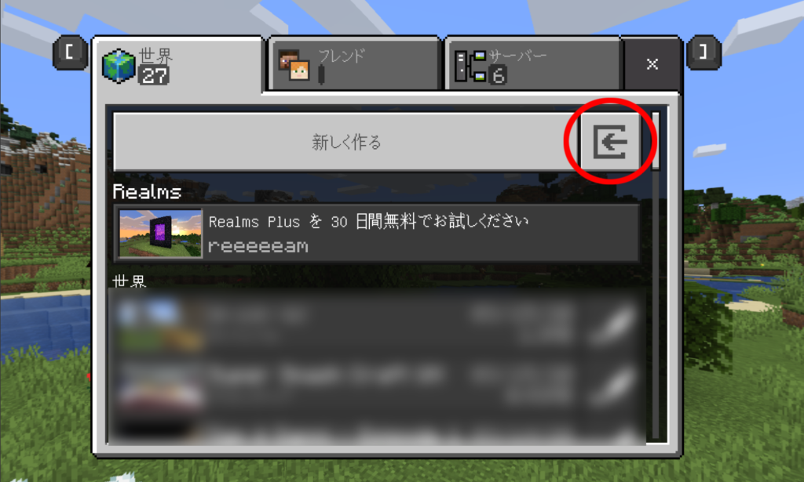](http://waabe.net/wp/wp-content/uploads/2020/03/2020-03-15_11h35_08.png)

上の画像の○をつけたところをクリックします

[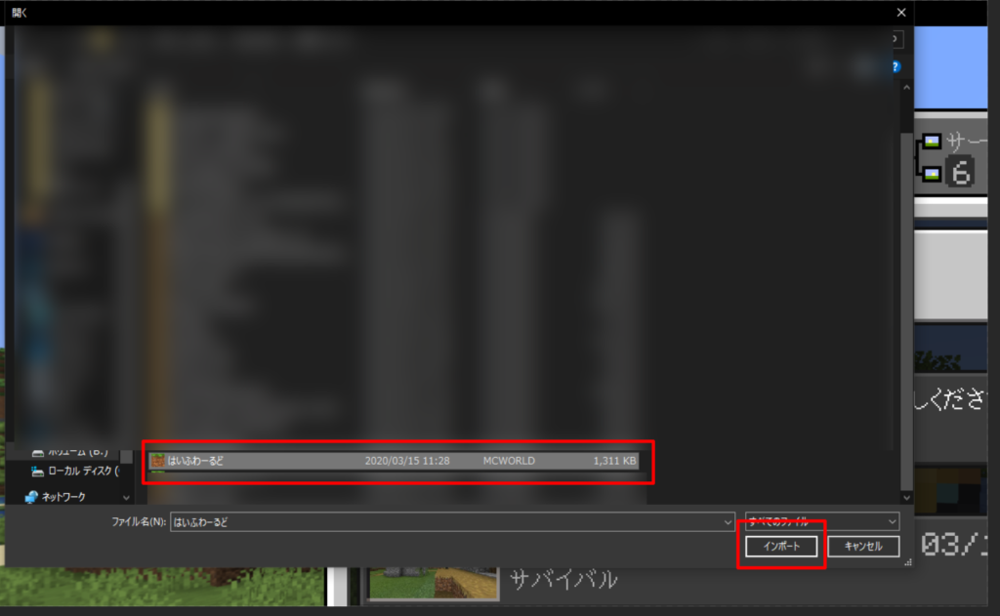](http://waabe.net/wp/wp-content/uploads/2020/03/2020-03-15_11h44_15.png)

ダウンロードしたものを選択して「インポート」をクリック

[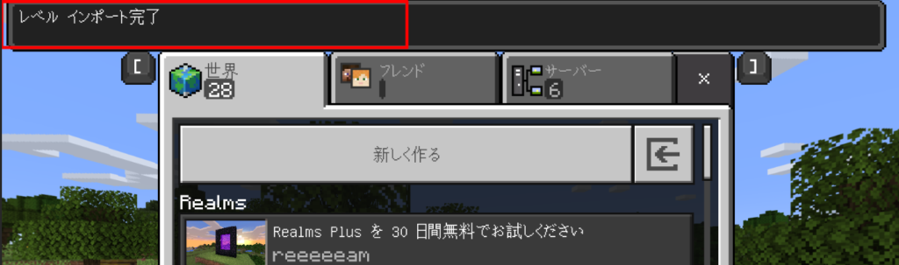](http://waabe.net/wp/wp-content/uploads/2020/03/2020-03-15_11h46_51.png)

「レベル インポート完了」と表示されたら完了です！

## iOS・iPad OS（iPhone、iPad）に入れたい場合

### 配布サイトからワールドをダウンロードする

まずは遊びたい配布ワールドをダウンロードしましょう  
もしまだ遊びたいワールドを見つけてない場合はこちらの記事を参考にしてみてください！

[

参考

Minecraftの配布ワールドを探す/投稿するならここ！おすすめサイトまとめ

WAAbe

](https://waabe.net/mcworld-schp/)

WAAbeでもいくつかオリジナルのワールドを配布しています

[

参考

Minecraft配布ワールド

WAAbe

](https://waabe.net/mchaihu/)

ファイル形式が「.zip」で終わるものと「.mcworld」で終わるものに分かれている場合はありますが、「.mcworld」で終わる方をダウンロードするようにしてください。

### iOS純正の「ファイル」アプリを使う

まずはiPhoneにもともと入っているファイルアプリを開きます。

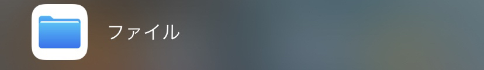

↓削除してしまった方はここから再インストールしてください

ファイル

Appleposted with[アプリーチ](https://mama-hack.com/app-reach/ "アプリーチ")

ファイルファイルアプリを開くと、いろんなファイルが表示されるの先程ダウンロードした**最後が「.mcworld」で終わるファイル**を探してタップしてください。

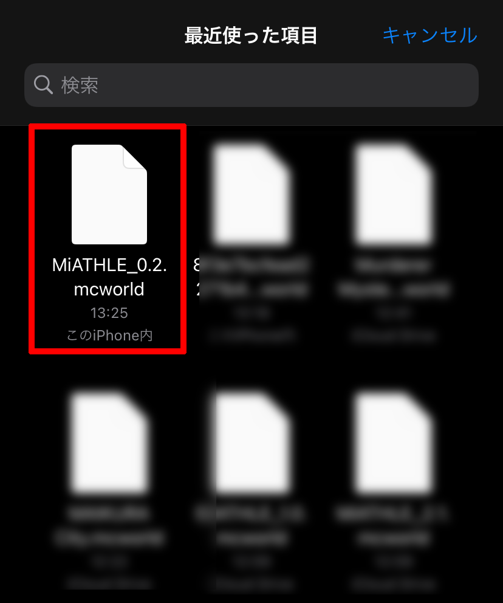

すると自動的にMinecraftのアプリが起動し、インポートがスタートするので「レベル インポート完了」と表示されると完了です。お疲れ様でした！

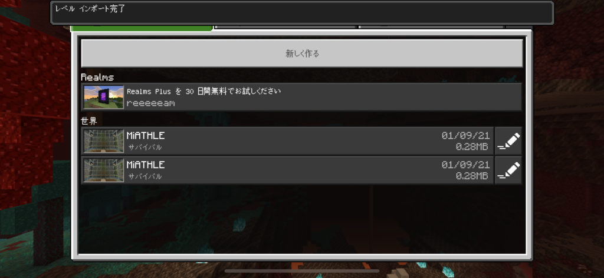

**「レベル インポート失敗」と表示される場合は以下を試してみてください**

### 「Documents by Readdle」を使う（純正アプリででできない場合）

純正アプリでインポートしようとすると失敗することがあります。その場合は「Documents by Readdle」といアプリを使ってみてください。

まずは↓からアプリをインストールしてください。

Documents by Readdle

Readdle Inc.無料posted with[アプリーチ](https://mama-hack.com/app-reach/ "アプリーチ")

インストールしたら説明などを読んでマイファイルを表示させます。**（課金はしなくてもOKなので無視してください）**  
下に小さく「Appleファイル」と記載がある「ファイル」という項目をタップ

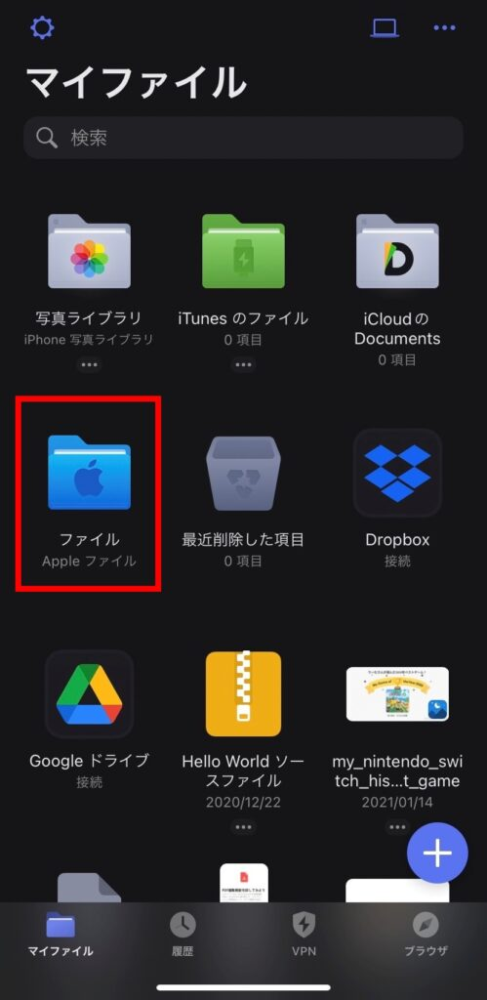

ダウンロードした最後が「.mcworld」で終わるファイルを探してタップしてください。

**「他のアプリで開く」**をタップ

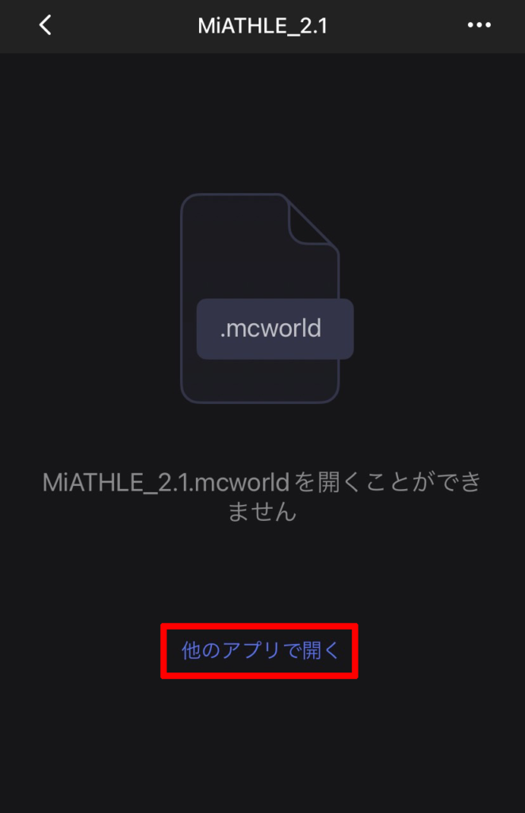

アプリの一覧から**「Minecraft」**をタップ  
※見つからない場合は、「その他」からMinecraftを選択してください。

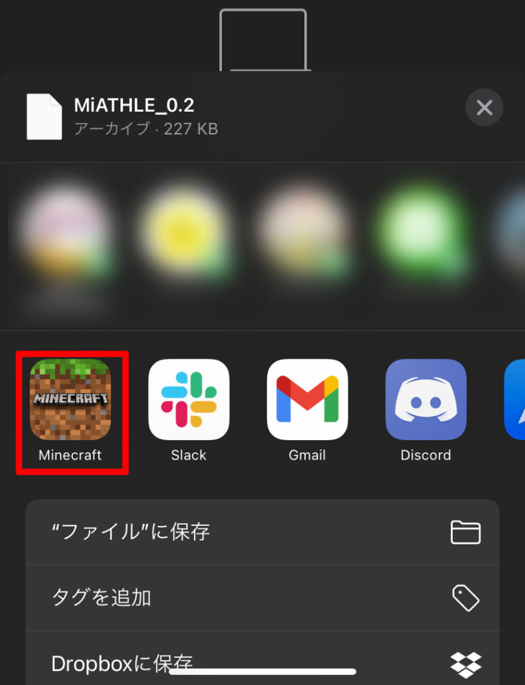

すると自動的にMinecraftのアプリが起動し、インポートがスタートするので「レベル インポート完了」と表示されると完了です。本当にお疲れ様でした！

## Androidに入れたい場合

### 配布サイトからワールドをダウンロードする

まずは遊びたい配布ワールドをダウンロードしましょう  
もしまだ遊びたいワールドを見つけてない場合はこちらの記事を参考にしてみてください！

[

参考

Minecraftの配布ワールドを探す/投稿するならここ！おすすめサイトまとめ

WAAbe

](https://waabe.net/mcworld-schp/)

WAAbeでもいくつかオリジナルのワールドを配布しています

[

参考

Minecraft配布ワールド

WAAbe

](https://waabe.net/mchaihu/)

#### 拡張子が「.zip」か「.mcworld」かを確認する

このとき、**ファイル形式が「.zip」で終わるものと「.mcworld」で終わるものに分かれている場合**があります。  
どちらの形式でも入れることができますが、手順が変わるので入れたいワールドの拡張子を確認してください。

「.zip」と「.mcworld」の両方がある場合は「.zip」がおすすめ！

下のボタンから選択してください

「.mcworld」で終わるワールド

[「.zip」で終わるワールド](#azip)

### 「.mcworld」で終わるワールドの場合

#### ファイルアプリを入れる

本記事ではFiles by Googleというアプリを利用します。標準でインストールされていない場合は以下からインストールしてください

Files by Google

Google LLC無料posted with[アプリーチ](https://mama-hack.com/app-reach/ "アプリーチ")

#### 拡張子名を変更する

まずは Files by Google を使い「.mcworld」から「.zip」に変換していきます。

アプリを開きダウンロード欄に「ワールド名.mcworld」のファイルをみつけをタップする

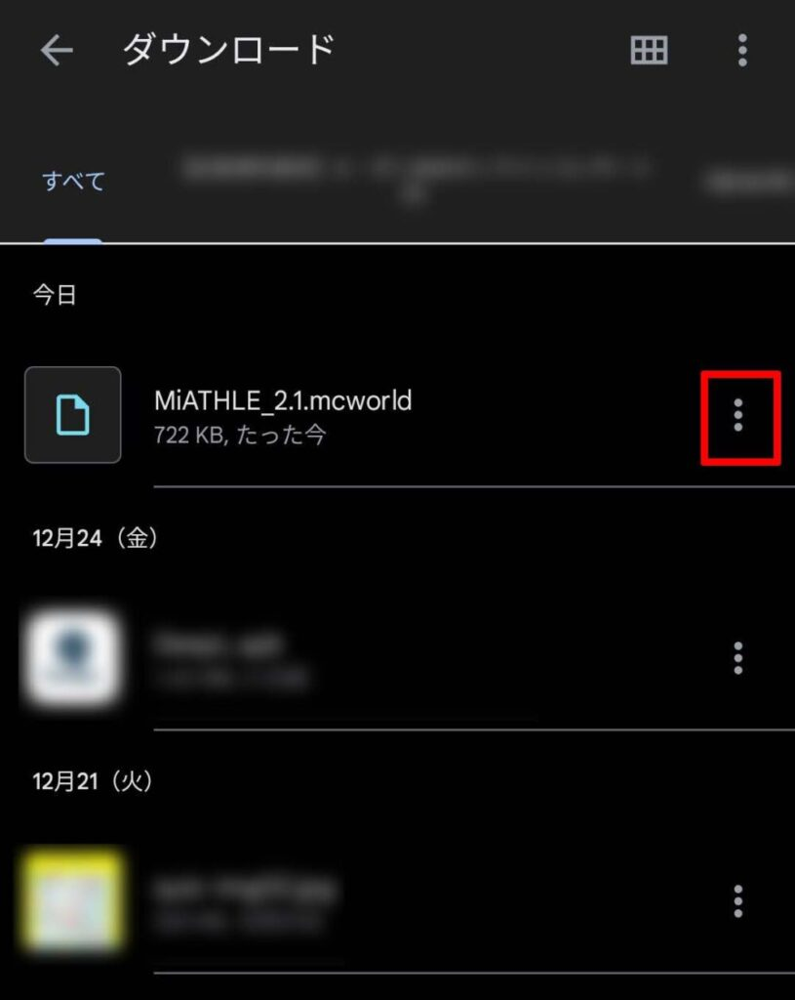

「名前を変更」をタップ

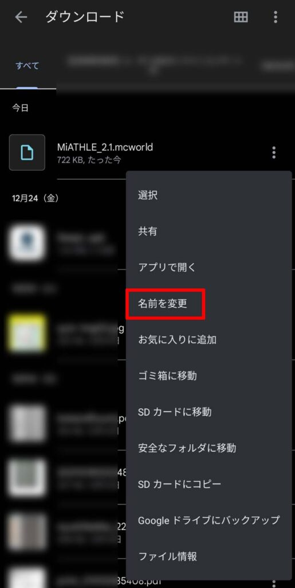

名前の最後の「maworld」の部分を「zip」に変更し、「\[ys\_icon name="check"\]OK」をタップ！

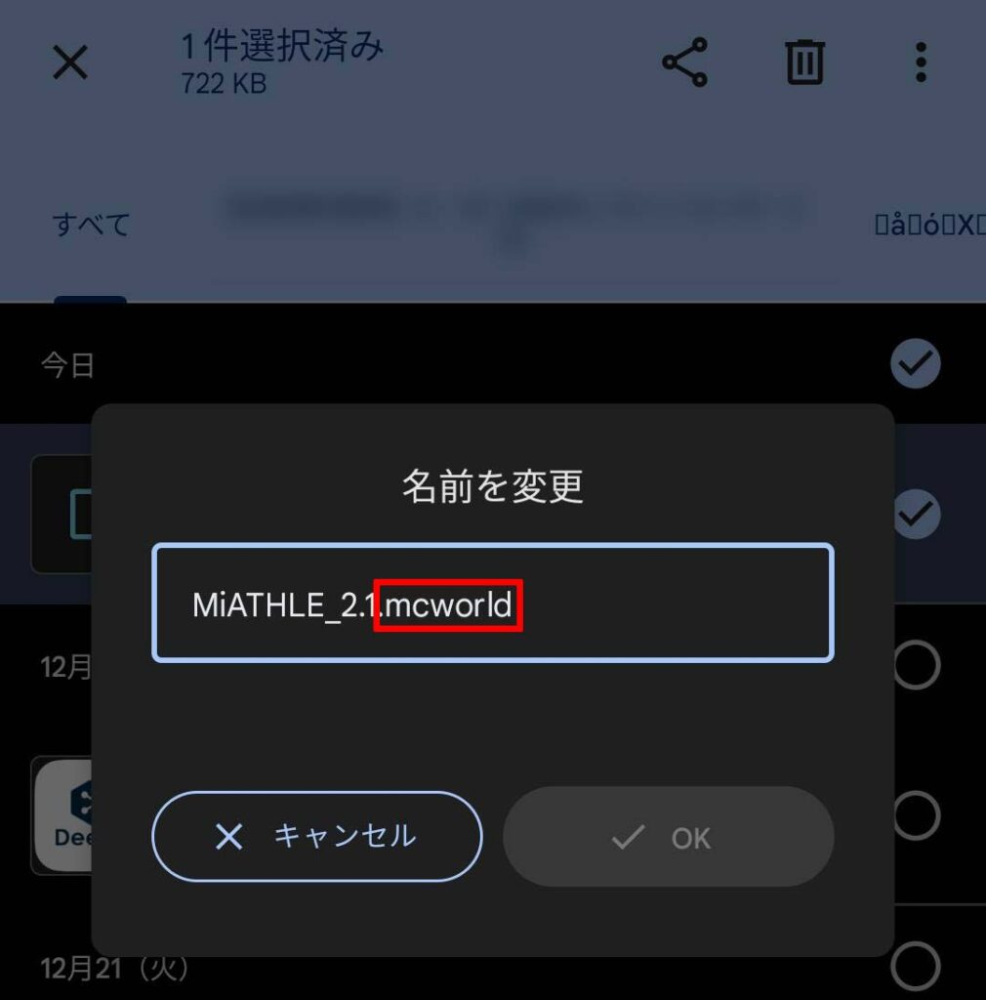

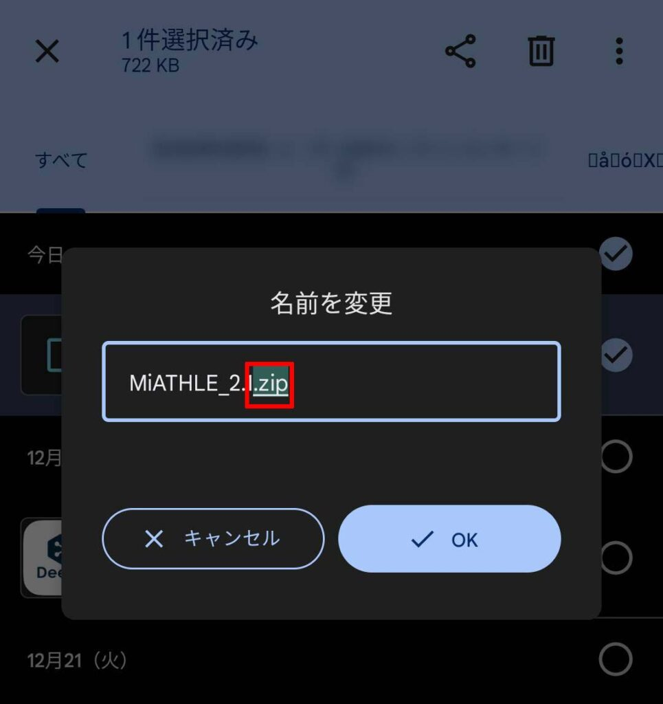

注意のポップアップが出ますが「\[ys\_icon name="check"\]名前を変更」を押して続行します

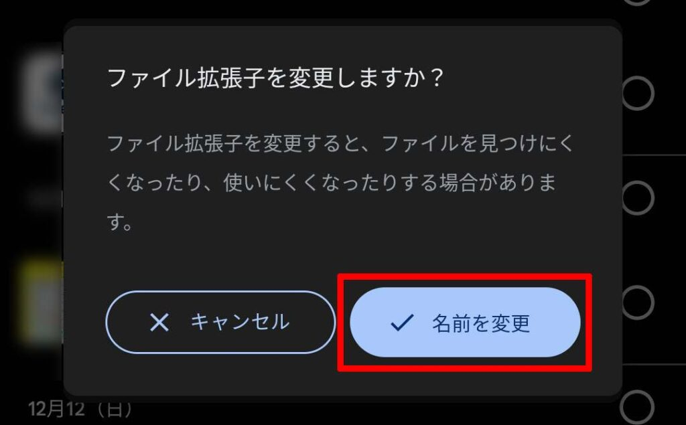

#### ファイルアプリで解凍していく

続いてZArchiverアプリを開きフォルダ一覧がでるのではじめにダウンロードしたフォルダをタップして、「ワールド名.zip」になっているファイルをタップします

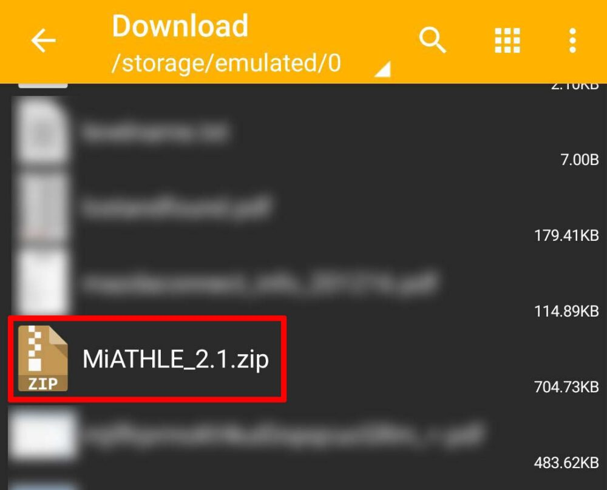

「\[ys\_icon name="upload"\]./<アーカイブ名>/に展開」をタップする

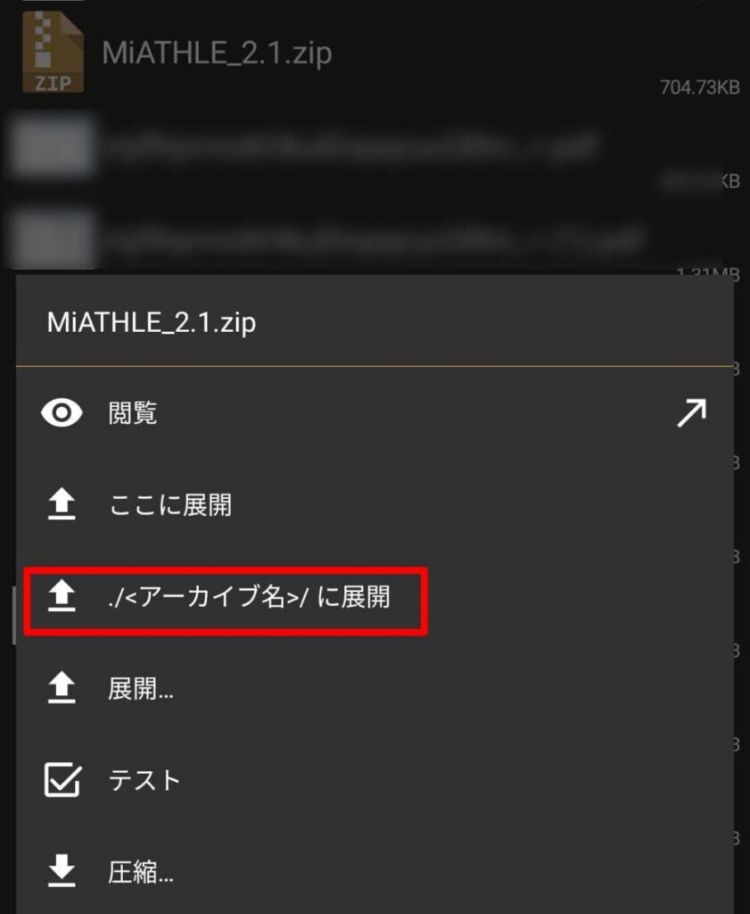

しばらくすると展開が完了し、.zipがついていなファイルが表示されれば解凍成功！

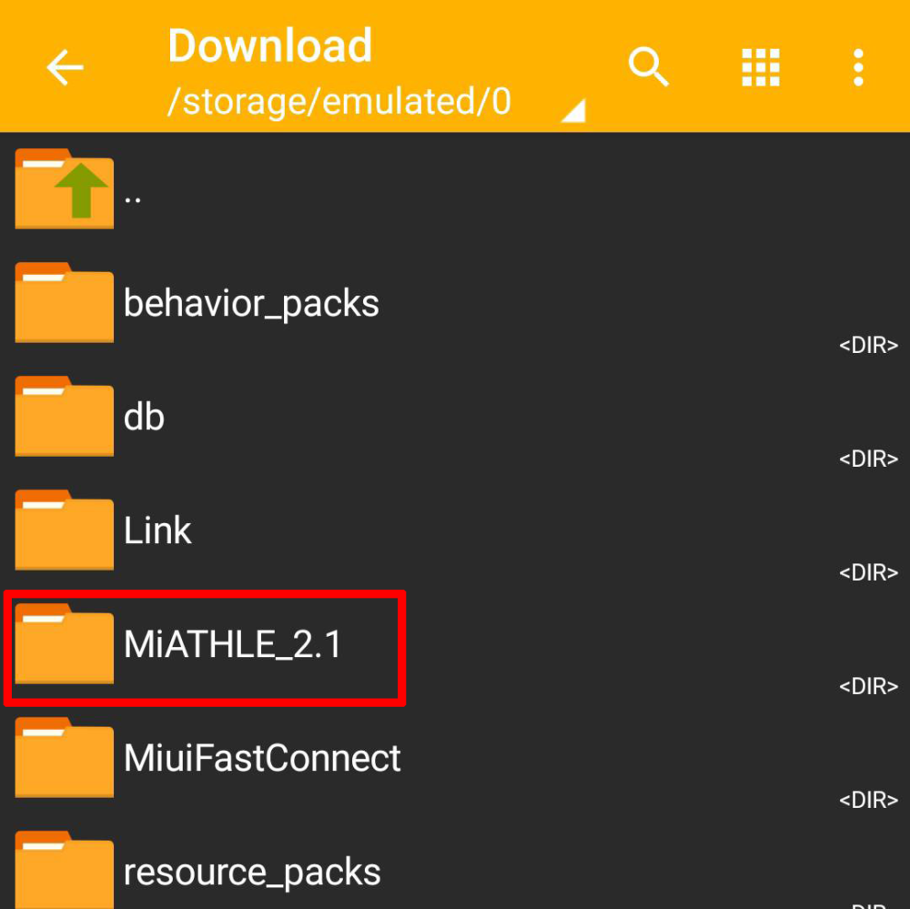

### マイクラのフォルダに入れる

解凍できたら再度 Files by Google アプリに戻ってきて

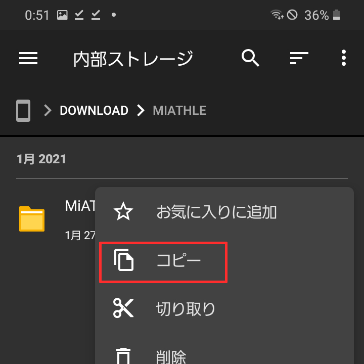

ここからは端末によるかもしれませんが、  
「アプリトップページの\[ys\_icon name="download"\]ダウンロード」→「games」→「com.mojang」→「minecraftWorlds」の順に進んでいく

そこまで進めたら、右上の\[ys\_icon name="clipboard"\]をタップ！先程コピーしたフォルダが表示されていたらファイルマネージャーでの作業は完了です。

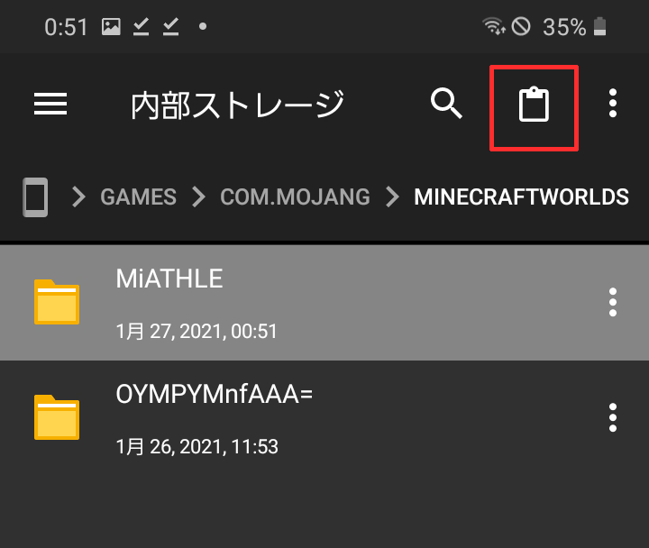

#### アプリを起動して確認

Minecraftアプリを起動して「世界」欄に目的のワールドが表示されていたら完了です！  
Androidが一番面倒くさかったとおもいます。お疲れさまでした！それでは楽しんで！

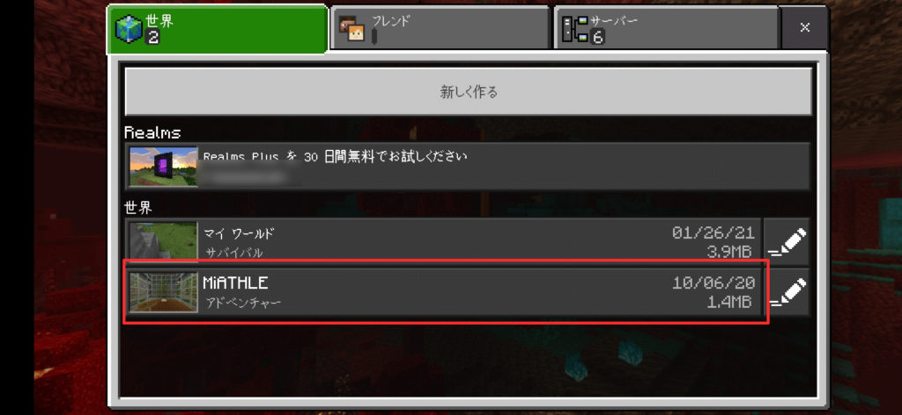
