Minecraftは他の人が作ったワールドを遊ぶことができます。今回はその「配布ワールド」の入れ方をご紹介します。

BEの入れ方はこちらから！

注意事項

- ワールドのダウンロードは自己責任でお願いします。

## Windows

### 配布サイトからワールドをダウンロードする

まだ配布ワールドを持ってない人は取り敢えずこちらのサイトから面白そうなワールドをダウンロードしてみてください！

おすすめサイト

### Minecraftに読み込む

#### 配布ワールドのファイルをみつける

「Windowsキー」+「R」を押すと「ファイル名を指定して実行」というのが出てくるので下の赤枠のところに「 **%appdata%** 」と入力し、OKをクリックしください。

[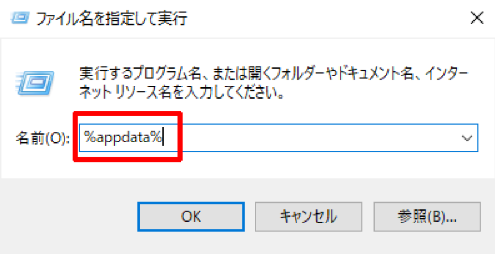](http://waabe.net/wp/wp-content/uploads/2020/01/2020-01-11_21h03_45.png)

すると、ファイルが開くのでそこにある「 **.minecraft** 」がマイクラのフォルダなので、開きます。

[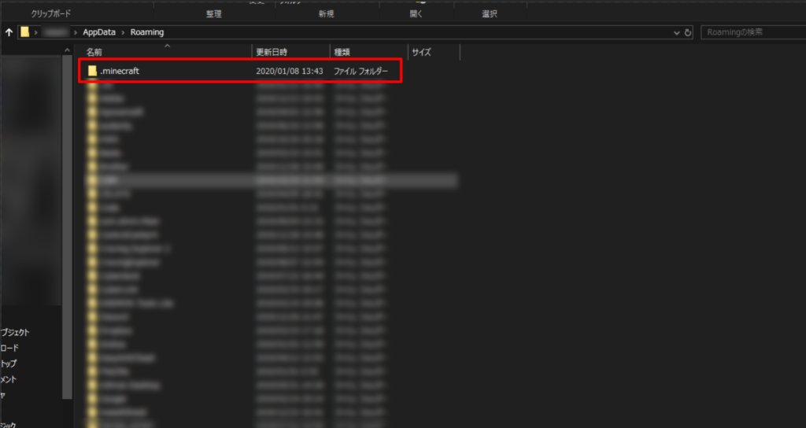](http://waabe.net/wp/wp-content/uploads/2020/01/2020-01-11_21h18_33.png)

ファイル内の「saves」がマイクラのデータフォルダなのでクリックして開いてください。

[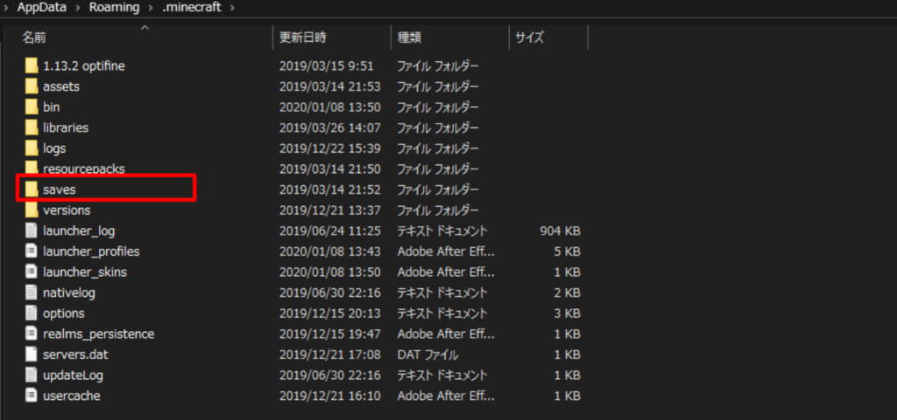](http://waabe.net/wp/wp-content/uploads/2020/01/2020-01-11_21h26_17.png)

#### ファイルに配布ワールドを入れる

「saves」ファイルを開いたら、配布ワールドのデータを**解凍してから**、「saves」ファイルに入れてください。

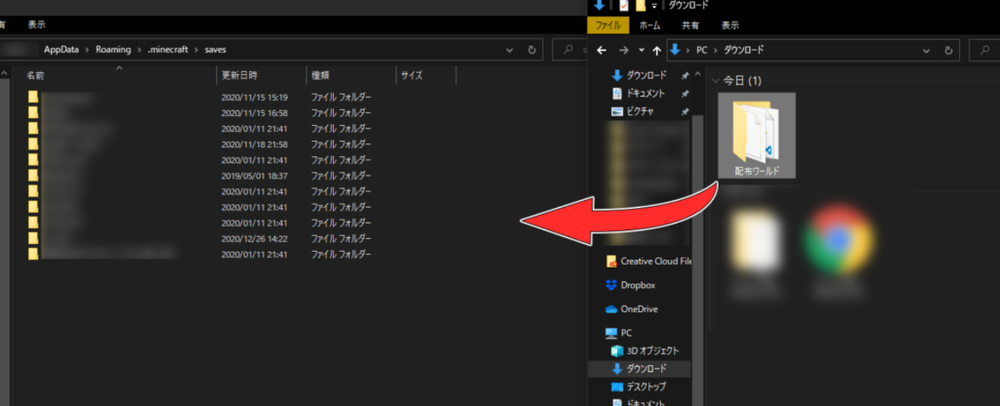

#### Minecraftを起動する！！

あとはマイクラを起動するだけ！

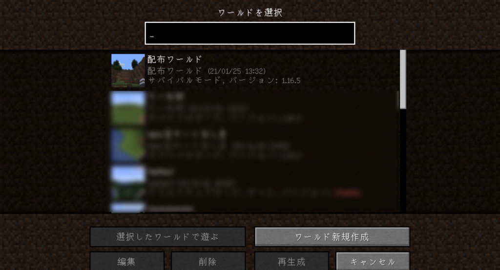

読み込んだワールドが表示されていたら、完了です！あとは遊びまくるだけ！

## Mac

### 配布サイトからワールドをダウンロードする

まだ配布ワールドを持ってない人は取り敢えずこちらのサイトから面白そうなワールドをダウンロードしてみてください！

おすすめサイト

### Minecraftに読み込む

#### 配布ワールドのファイルをみつける

「Finder」アプリを起動します。

<figure>

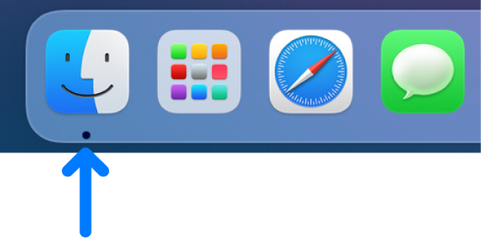

<figcaption>

引用元：Appleサポート（https://support.apple.com/ja-jp/guide/mac-help/mchlp2803/mac）

</figcaption>

</figure>

メニューバーの移動→「ライブラリ」をクリック

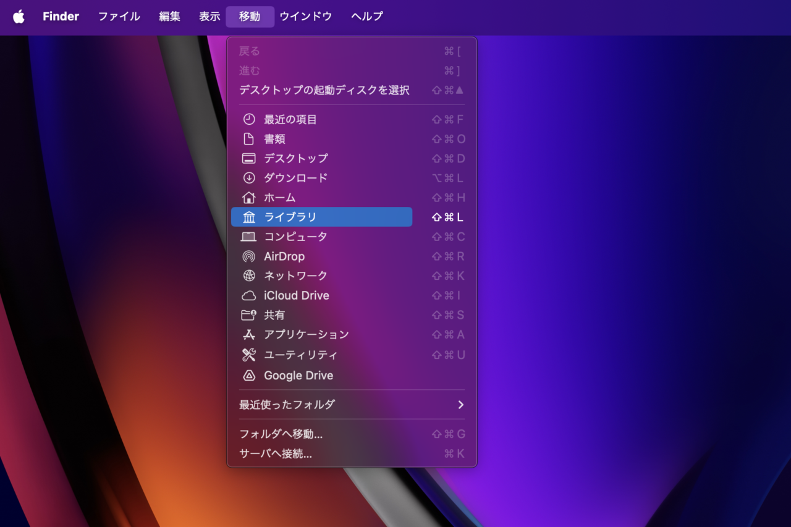

ライブラリが表示されるので「Application Support」をクリックして開く

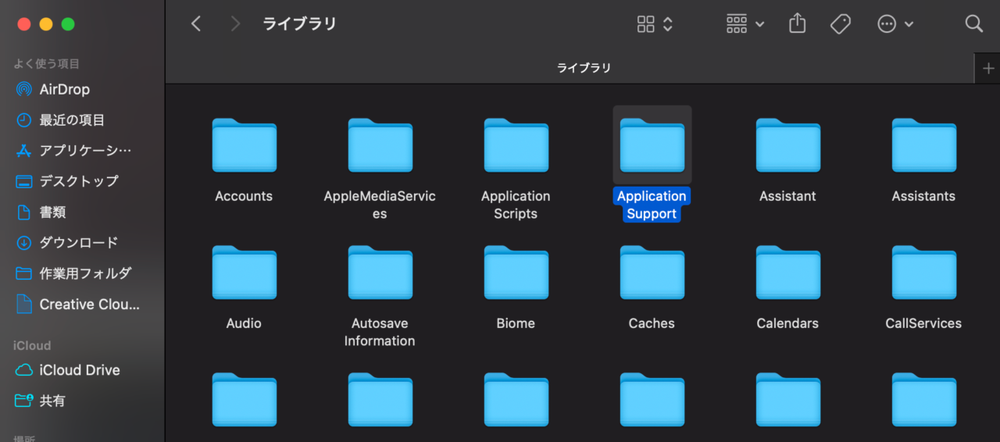

「minecraft」がMinecraftのファイルなのでクリック！

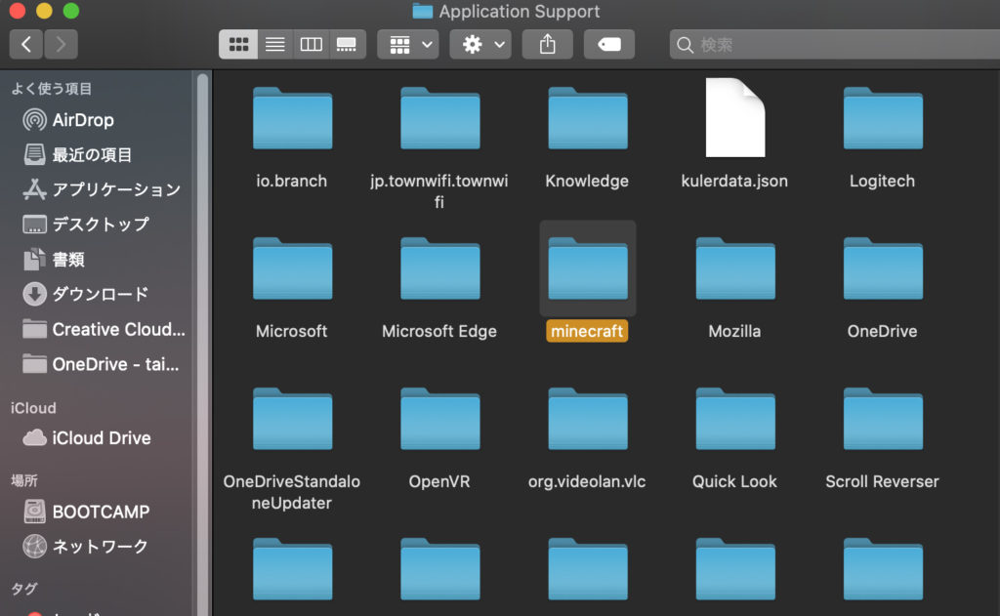

ファイル内の「saves」がマイクラのデータファイルなのでクリックして開いてください。

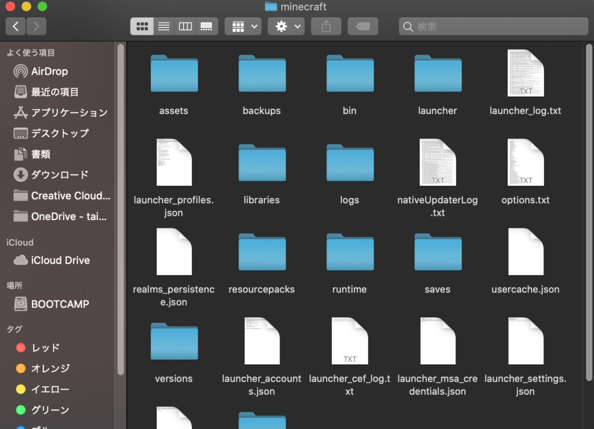

#### ファイルに配布ワールドを入れる

初めにダウンロードしていた配布ワールドを必ず解凍してから「saves」ファイルに入れます

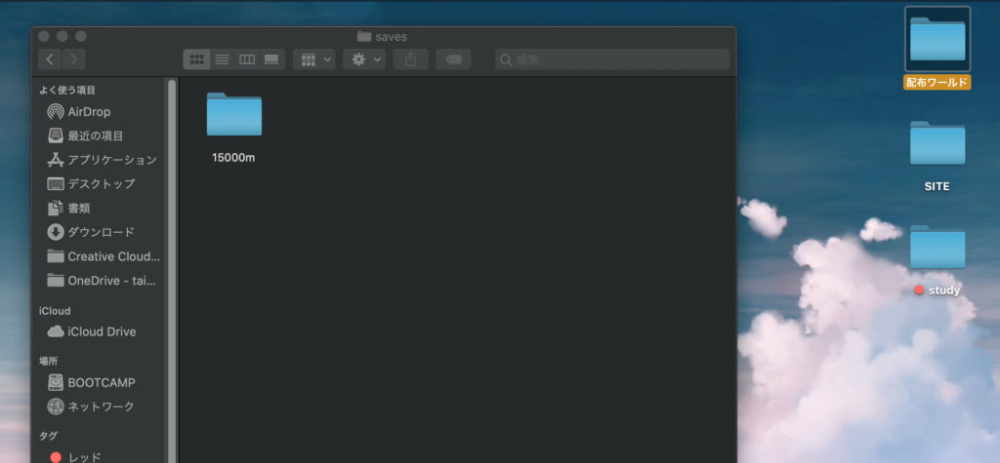

#### Minecraftを起動する！！

あとはマイクラを起動するだけ！

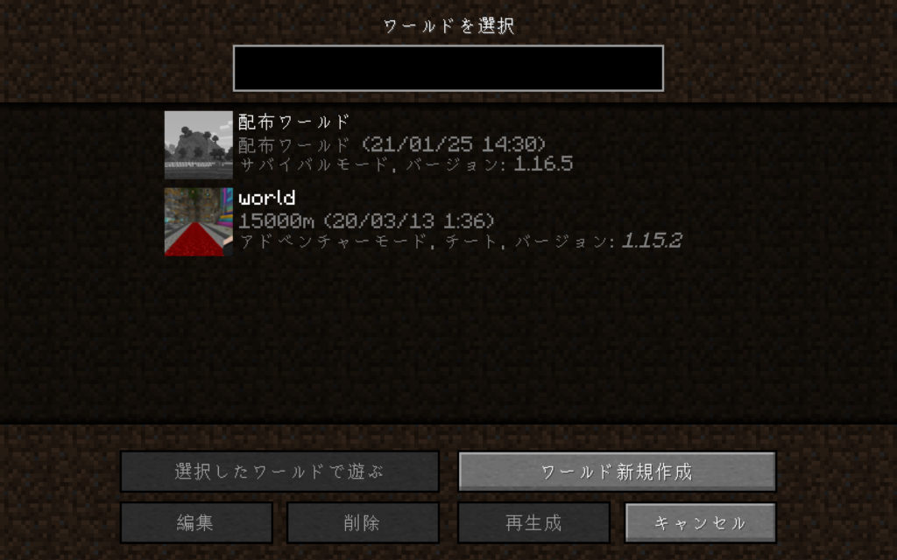

読み込んだワールドが表示されていたら、完了です！あとは遊びまくるだけ！
