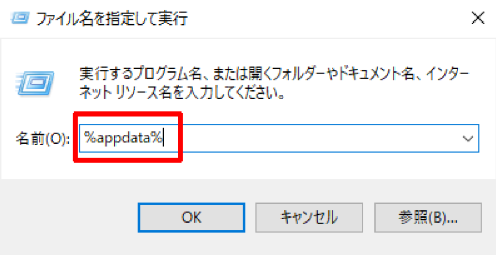
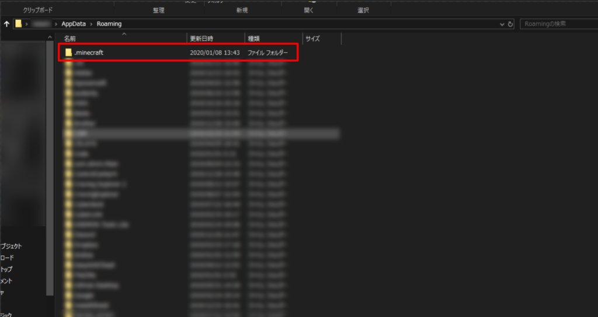
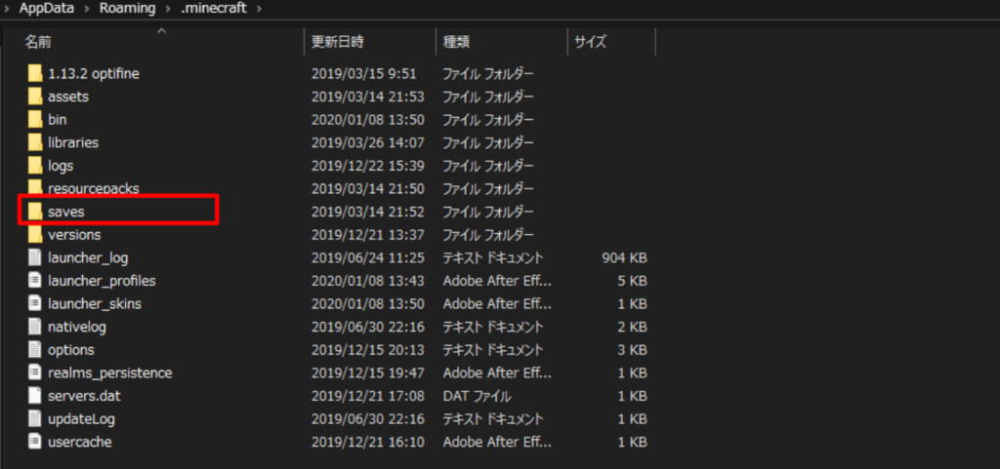
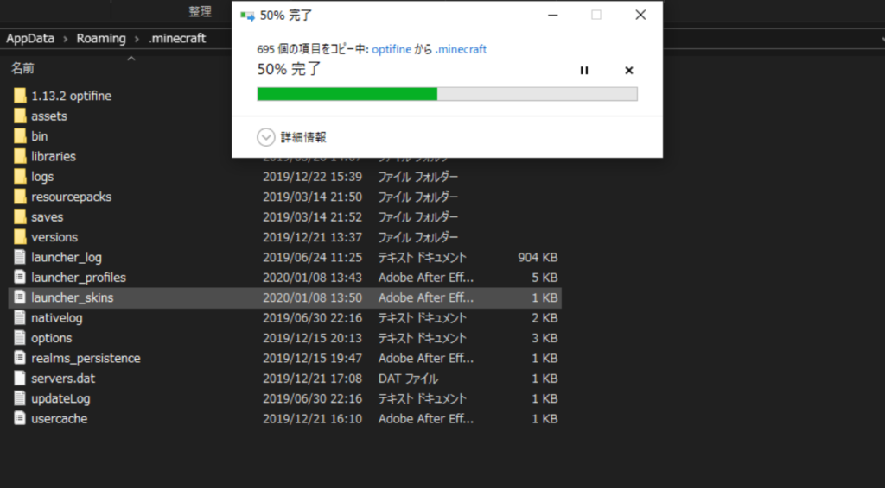

こんにちは！

PCを買い替えたりしたときMinecraftのソフトは入れなおしたけどデータはどうやって前のPCからもってきたらいいの？とおもっているあなたに今回はマイクラのデータの移行方法をご紹介します！

注意事項

- 説明にはWindows10を使用します。（Windowsなら8や7でも見た目は違いますが多分できます。
- 自己責任でおねがいします。
- 事前にMinecraftをPCにインストールしておいてください。

### 旧PCからデータをコピーする

#### セーブデータを探す

「 Windowsキー」+「R」を押すと「ファイル名を指定して実行」というのが出てくるので下の赤枠のところに「 **%appdata%** 」と入力し、OKをクリックしください。

すると、ファイルが開くのでそこにある「 **.minecraft** 」がマイクラのファイルなので、開きます。

ファイル内の「saves」がマイクラのデータです。これをコピーしてください  
（ワールドごとに移行したい場合はsavesを開くと出てきます）

### データを送る・保存する

先ほどコピーしたデータをメールに添付しておくったり、SDカードやUSBメモリ、外付けHDD・SSDに入れてもOKです。

### 新PCにデータをコピー

#### セーブデータを探す

「Windowsキー」+「R」を押すと「ファイル名を指定して実行」というのが出てくるので下の赤枠のところに「 **%appdata%** 」と入力し、OKをクリックしください。

すると、ファイルが開くのでそこにある「 **.minecraft** 」をクリック

ファイルを開いたらコピーしていた 「**saves**」 のファイルを貼り付けます。

上書きしますか？的なやつがでてくることがありますが、その場合は上書きしてください。

\-完了\-

わからないこと等がありましたら、コメントお願いします????
