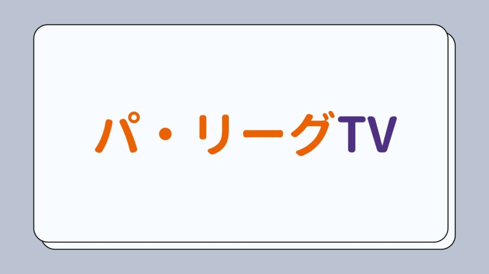

## あなたに合ったサービスをみつけよう

### サービスの特徴を一言でまとめました！

**クリックすると各サービスの特徴がみられます**

## 各サービスの特徴

### パ・リーグTV

パ・リーグTVはパ・リーグ6球団が共同出資して作られた会社が運営しているサービスです。  
制作・権利者である球団が運営しているサービスなので観られるコンテンツは一番多いかも！

#### 価格

1dayチケット：660円  
見放題（通常会員）：1,595円  
見放題（ファンクラブ）：1,045円

#### 対応デバイス

PC、スマートフォン

#### ほかのサービスにはない特徴

- 各球団ファンクラブに入っていると、お得に観られる

- **キャンプ地での試合や優勝特番など、通常の試合以外も見放題で楽しめる**

- **1dayチケットもある**ので、一日だけ観たい！という場合でもOK

- 過去10年分の試合が見放題

- マルチアングル、実況OFFなど多機能

- 交流戦のみ、巨人・阪神主催試合も中継

#### 気になったところ

- 他サービスに比べて価格は高め

- テレビでみることはできない

- 見逃し配信はイニングごとに分かれてしまっている

公式サイトはこちら

[パーソル パ・リーグTV](https://pacificleague.com/ptv)

### ベースボールLIVE

ベースボールLIVEはソフトバンクが運営しているパ・リーグ配信サービスです。  
特徴は何といっても月額550円という安さ！それでいて高画質で全試合見放題で利用できます。  
さらにソフトバンク回線を使っている人（条件有）はPayPayポイント20%還元されるので実質450円相当で利用できることになります。

#### 価格

～2024年2月29日：**550円**  
2024年2月29日～：**660円**  
ソフトバンク指定の料金プランへの加入で：税抜価格の20%がPayPayポイントで還元

#### 対応デバイス

PC、スマートフォン、テレビ（Chromecastのみ）

#### ほかのサービスにはない特徴

- **月額550円で試合が見放題**

- ソフトバングユーザーならさらにお得になるかも

- ホークス主催のPayPayドームでの試合は**マルチアングル・VR映像**を楽しめる

#### 気になったところ

- 他サービスに比べ、基本的な機能は少ない（PiP、バックグラウンド再生などができない）

- 配信が不安定なときがある

公式サイトはこちら

[ベースボールLIVE](//baseball.mb.softbank.jp/service/)

### パ・リーグSpecial

パ・リーグSpecialは楽天が運営しているサービスです。  
月額ではベースボールLIVEに劣りますが、年額プランをは一番安くキャンペーンなどを利用すればとてもお得に楽しむこともできます。  
さらに**楽天モバイルユーザーはなんと無料で全コンテンツを観ることができます**。

#### 価格

月額プラン：702円/月  
年額プラン：**5,602円/年**  
楽天モバイルユーザー：**0円**（Rakuten パ・リーグSpecial for 楽天モバイル）

#### 対応デバイス

PC、スマホ、テレビ（Chromecast、FireTV、AndroidTV、AppleTV等）、ゲーム機（PS4）

#### ほかのサービスにはない特徴

- 年額プランは一番お得

- **楽天モバイルユーザーは無料で観られる！**

- **対応デバイスが多い**（FIreTVなどでもOK）

- 楽天ファン向けコンテンツが充実

#### 気になったところ

- イニング間に広告が入る

- バックグラウンド再生ができない（PIPはできる）

実際に使ってみた詳細レビューも書きました！

[

参考

年間プランは一番お得⁉&楽天モバイルユーザーは無料で使える！「パ・リーグSpecial」レビュー

WAAbe

](https://waabe.net/paleague-sp/)

**\\ 公式サイトはこちら /**

[パ・リーグSpecial](https://sports.tv.rakuten.co.jp/pacificleague/)

**\\ 楽天モバイル特典について詳しくはこちら /**

[楽天モバイルならパ・リーグ0円で観られる！](//ck.jp.ap.valuecommerce.com/servlet/referral?sid=3599413&pid=889368553)

### DAZN

DAZNはパ・リーグのみならず、広島カープを除いたセ・リーグ、さらにはJリーグやモータースポーツやeスポーツまで様々なスポーツが観られます。価格は高いですが、セ・リーグも観たい人やプロ野球以外のスポーツも観たい方にはイチオシのサービスです。

#### 価格

DAZN Standard（月額）：3,700円/月  
DAZN Standard（年額・月払い）：3,000円/月(36,000円/年)  
DAZN Standard（年額・一括）：30,000円/年（2,500円/月）  
povoDAZN7日間パック：925円/回

#### 対応デバイス

PC、スマートフォン、テレビ（Chromecast、FireTV、AndroidTV、AppleTV等）、ゲーム機（PS4、Xbox）

#### ほかのサービスにはない特徴

- **セ・リーグ（カープ以外）も観られる**

- ＝セ・リーグ主催の交流戦やオープン戦も観られる

- 対応デバイスが多い

- **プロ野球以外のスポーツも観られる**

#### 気になったところ

- 価格が高い

- 解約時の引き留めが凄く面倒くさい

公式サイトはこちら

[DAZN](https://h.accesstrade.net/sp/cc?rk=0100nese00mzdg)

### スカパー！プロ野球パック

スカパー！プロ野球パックはCSのプロ野球関連チャンネルがすべてセットになったパックで、広島カープを含めた12球団の試合（ファームやオープン戦も）や関連ニュースなども観られます。  
CSですが、一部を除きスマホアプリやPCブラウザで観ることも可能！

#### 価格

月額：4,054円+基本料429円  

#### 対応デバイス

PC、スマートフォン、テレビ（CS放送）  
※PC、スマホは一部の放送は非対応

#### ほかのサービスにはない特徴

- **セ・リーグ（カープ以外）も観られる**

- ＝セ・リーグ主催の交流戦やキャンプ中継なども全て観られる

- 対応デバイスが多い

- **プロ野球以外のスポーツも観られる**

#### 気になったところ

- プロ野球のすべてを網羅したい人以外にとっては価格がとても高い

- テレビで観るならCSが観られる環境が必要

公式サイトはこちら

[スカパー！プロ野球パック](//ck.jp.ap.valuecommerce.com/servlet/referral?sid=3599413&pid=889011776)

### ホークスTV

ホークスTVはベースボールLIVEのコンテンツ（パリーグ見放題）に加え、ホークスファン向けのオリジナル番組やファーム（2～4軍）の試合、特番やキャンプ映像も見放題になるサービスです。

#### 価格

月額：900円  

#### 対応デバイス

PC、スマートフォン、テレビ（Chromecast・一部コンテンツ除く）

#### ほかのサービスにはない特徴

- **オリジナル番組+ファーム中継+ベースボールLIVEと考えるとコスパは良い**

- オリジナルコンテンツは質が高くてホークスファンなら満足できそう

#### 気になったところ

- （当たり前だけど）ホークスファン専用

- ベースボールLIVEが好みではない（別の見放題サービスも使っている）ホークスファンは割高に感じるかも

公式サイトはこちら

[ホークスTV](https://www.softbankhawks.co.jp/ex/hawkstv/)

## まとめ

最後に今回紹介したサービスを表でまとめてみました。  
こちらも是非参考にしてみてください！

|  | 機能性 | 観られる球団 | 対応端末 | 料金 |  |
| --- | --- | --- | --- | --- | --- |
| パリーグSpecial | 多機能 | パ6球団 | 多い | 非常に良い | [公式サイト](https://sports.tv.rakuten.co.jp/pacificleague/) |
| DAZN | 普通 | セパ11球団  
（広島以外） | 多い | 人による | [公式サイト](https://h.accesstrade.net/sp/cc?rk=0100nese00mzdg) |
| パ・リーグTV | **超多機能** | パ6球団 | 普通 | 良い | [公式サイト](https://pacificleague.com/ptv) |
| ベースボールLIVE | 多機能 | パ6球団 | 普通 | 非常に良い | [公式サイト](https://baseball.mb.softbank.jp/service/) |
| スカパー！  
プロ野球パック | 多機能 | **セパ12球団** | 普通 | 人による | [公式サイト](https://ck.jp.ap.valuecommerce.com/servlet/referral?sid=3599413&pid=889011776) |

パ・リーグはセ・リーグと違い配信の選択肢が多いので、用途や目的によって選ぶことができます。  
このサイトをみることであなたに合ったサイトが見つかっていたら幸いです。  
もし、書き逃していたサイト等があれば是非コメント欄にお書きください！

### （おまけ）テレビで見るならChromecastがおすすめ

AndroidTVが搭載されていないテレビを使って配信の野球中継をテレビで見るにはChromecastやFireTVstickが必要になりますが、DAZNやパ・リーグSpecial以外のサイトはChromecastでしか観られないサイトも多いため、野球中継メインで使うならChromecastを購入するのがおすすめです。

Amazonのセール期間中はFireTVがお得！
