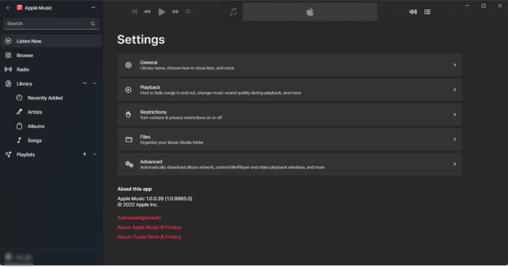

以前CiderというWindowsで[AppleMusicを聴けるサービスを紹介した](https://waabe.net/itunes-cider/)のですが、なんと

公式のアプリが登場しました！

## iTunesとくらべてどう？

ゴミUI・ゴミフォント・ノロノロ動作からWindows11とMac版のApple Musicをかけ合わせたような使いやすいUIに変わっています。

<figure>

<figcaption>

←新　　旧（iTunes）→

</figcaption>

</figure>

神

欲を言うと游ゴシックUIは嫌いなのでそれは変えたいです....

「見つける」ページなど日本語にも一部対応しています。

サイドバーや設定ページは英語のみ（22/02/05現在）。  
→サイドバーや設定ページ含めすべて日本語にも対応しました！

## ロスレス・ハイレゾロスレスにも対応

公式のアプリなのでロスレスオーディオにも対応しています。

非公式クライアントのCiderではロスレスが使えないのが唯一のデメリットでした。

これまでWindowsで使える低価格サブスクでロスレスが聴けたのはAmazon Musicだけだったのでこれはかなり嬉しいポイントです。

いまはプレビュー版のためか歌詞はみられないようです。これは正式版を期待しましょう。。

歌詞もみられるようになりました！後日スクショも貼ります。

## インストールはこちらから

→日本語も追加されたので、検索するとでてくるようになりました！

Microsoft Storeで「Apple Music」と検索するか↓のリンクをクリックするとダウンロードページにたどりつけます。

[

参考

Apple Music を入手 - Microsoft Store ja-JP

Microsoft Store

](https://www.microsoft.com/ja-jp/p/apple-music/9pp5m2pj95gx)

Spotifyはとても使いやすいのですが音質が悪い、Amazon Musicは音質は最高ですがUIや検索精度などがあまりにわるくて使い物にならないという悩みがあったので、今回AppleMusicがWindowsに対応してくれたことでこの悩みが解決できそうです。

AppleとMicrosoftありがとう！！今度はGoogleと一緒にAirdropとニアバイシェアをどうにかしてくれ。
