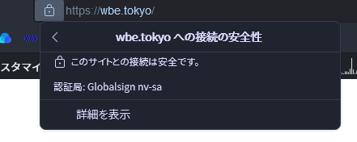

高速・高機能・高安定性に優れたレンタルサーバーとして知られるConoHa WING。  
WordPressの簡単インストール機能、WEXAL®の無償提供、ピュアSSD、HTTP/2対応などいろいろ性能が良いらしいですが、ここでは**性能以外の隠れた意外なメリットやデメリットをまとめていきます！**

もう「ConoHa WINGの評判は？」系の記事を全部見たけど、まだ他のレンタルサーバーと迷うな～…

という方は、是非一度読んでみてください！

  

## ちょっとしたメリット

### 永久無料ドメインの種類が多い！しかも2つ無料！！

最近どのレンタルサーバーもやっている、契約中はドメイン永久無料！というサービス。正直どこで契約も一緒だと思っていませんか？  
「.com」や「.net」などの有名どころのドメインはたしかにどこのレンタルサーバーでも永久無料というところが多いのですが、少しニッチなドメインは対象外なサーバーがほとんどです。  
しかし**ConoHa WINGは「.tokyo」ドメインなども対象に**なっているので、現在、すでにドメインを取得しているのに、他のレンタルサーバーの永久無料の対象になっていなかったという人は一度ConoHa WINGをチェックしてみてほしいです！

ちなみにこのサイトも「wbe.**tokyo**」なのでありがたく無料の恩恵を受けさせていただきました。

更に！これだけではありません！ConoHa WINGはなんと**２つ永久無料のドメインがもらえます**！  
２つ目のドメインは逆に「.com」などの有名どころがないのですが、サブのサイトなどを作るならとてもお得です。

### 無料SSLがAlphaSSL

こちらも、いまはどのレンタルサーバーでも無料で使える機能であるSSLですが、ここでもConoHa WINGは一味違います。ConoHa WINGは一般的な無料SSLである、「Let's Encrypt」だけでなく**「AlphaSSL」も無料で**設定することができます。

「AlphaSSL」はGMOグローバルサイン社が提供しているSSLで定価6000円以上するSSLなのですが、これがなんとConoHa WINGでは無料で利用することができます。

とはいえAlphaSSLとLet's Encryptのセキュリティの強さは同じで認証方式もドメイン認証、サイトシールもなしなのでとくに大きな違いはありません。でも！

ブラウザに「認証局：GlobalSign」と表示されるのちょっとかっこよくないですか！

# ちょっとしたデメリット

### CloudFlareは使えない

ConoHa WINGはネームサーバーがConoHa WINGのものになっていないと、無料SSLが更新できないのでおそらくCloudFlareは使えません。

やり方はあるかもしれないですが、同じような仕様のロリポップはサポート外ということなので、自分のような初心者は使えないといっても良いでしょう。

WordPressでCloudFlareを使っても大して意味は無いらしいのですが、好奇心旺盛な初心者は使ってみたくなっちゃいます...!

### 簡単インストールはWordPressのみ

比較的新しいレンタルサーバーということもあるのか、簡単インストールできるのはWordPressのみです。

WordPress以外使わない人はシンプルでむしろそっちの方が良いと思いますが、NextCloudやYOURLSなど便利ツールも簡単に使ってみたい！（自分は自力で入れました）

## まとめ

個人的に思ったのはちょっとしたメリットはGMOのサービスならではのものが多いな！と感じました！

レンタルサーバー導入の決め手にしていただけたでしょうか？

**\\ 公式サイトはこちら /**

[ConoHa WING](//af.moshimo.com/af/c/click?a_id=2104270&p_id=2312&pc_id=4967&pl_id=30490)
