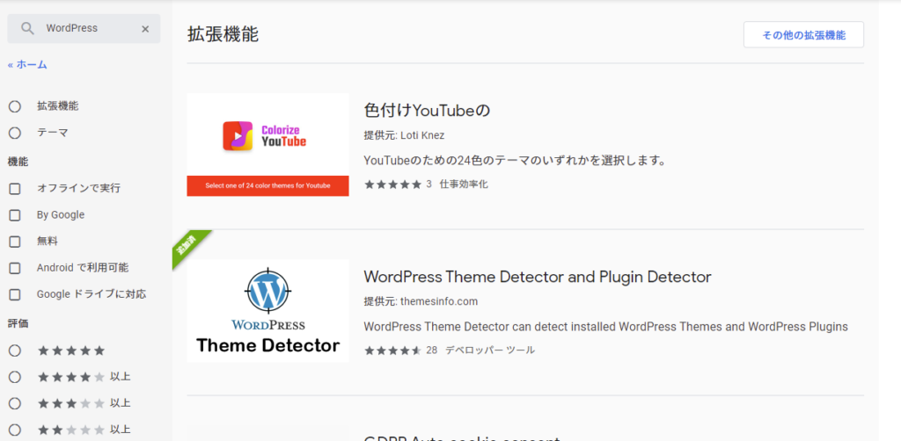
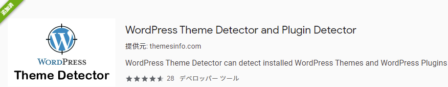
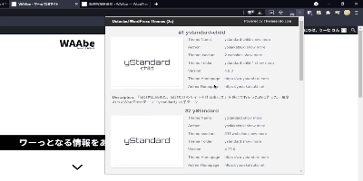

今まで

このブログめっちゃ綺麗！どんなWordPressのテーマ使ってるんだろう

とおもったときには**[WPSNIFFER](https://chrome.google.com/webstore/detail/wordpress-theme-detector/bjccepbfbikbpbgillfgicihhmpmjbjd)**というChrome拡張機能を利用していて、

このブログの機能神！どんなWordPressのプラグイン使ってるんだろう

とおもったときには**WHAT WORDPRESS THEME IS THAT?**というサイトを利用していました。

どちらも便利ではあったのですが、特にプラグインはわざわざサイトにアクセスして調べないといけないのでとってもめんどくさくて、後回しにした結果結局ないがしろにしてしまうことが多かったです、、

そこで、この広いChromeウェブストアにはもっと素晴らしい拡張機能があるのではないか！！と思いてきとうに「WordPress」と検索してみると、、

**あったーーー！**

とはならなかったのですが、themeとかpluginとか書いてあるので入れてみると！

全部みれる！！！親テーマも子テーマもプラグインまで全てみることでできます！

まさに神拡張機能をみつけてしまいました！

拡張機能はこちらから↑

  
唯一デメリットをあげるとすれば、WPSNIFFERが一瞬でテーマを調べてくれるのにたいしてこの拡張機能は数秒待たないといけない点です。自分のようなプラグインも調べたい方には数秒ごときどうってことないですが、テーマがわかれば十分という方にはWPSNIFFERで十分だとおもいます

ということで今回はWordPressで他の人が使っているテーマやプラグインをかんたんに確認できる拡張機能のご紹介でした！

作者が違うような気はしますがFirefoxでも同じ機能が使えるアドオンをみつけたので貼っときます↓
