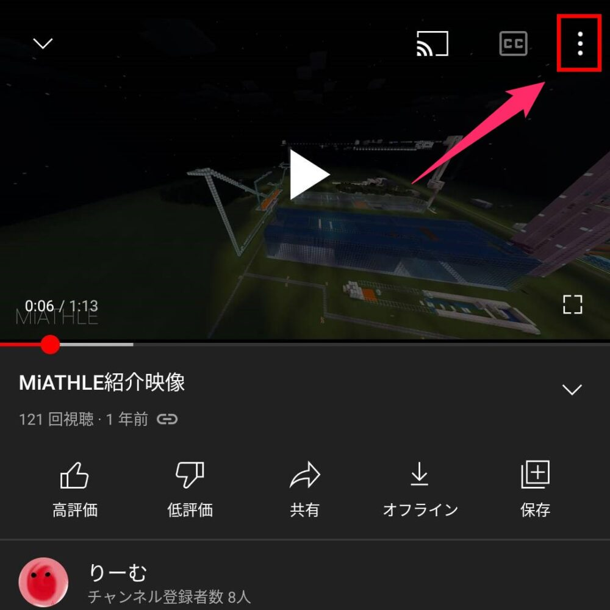
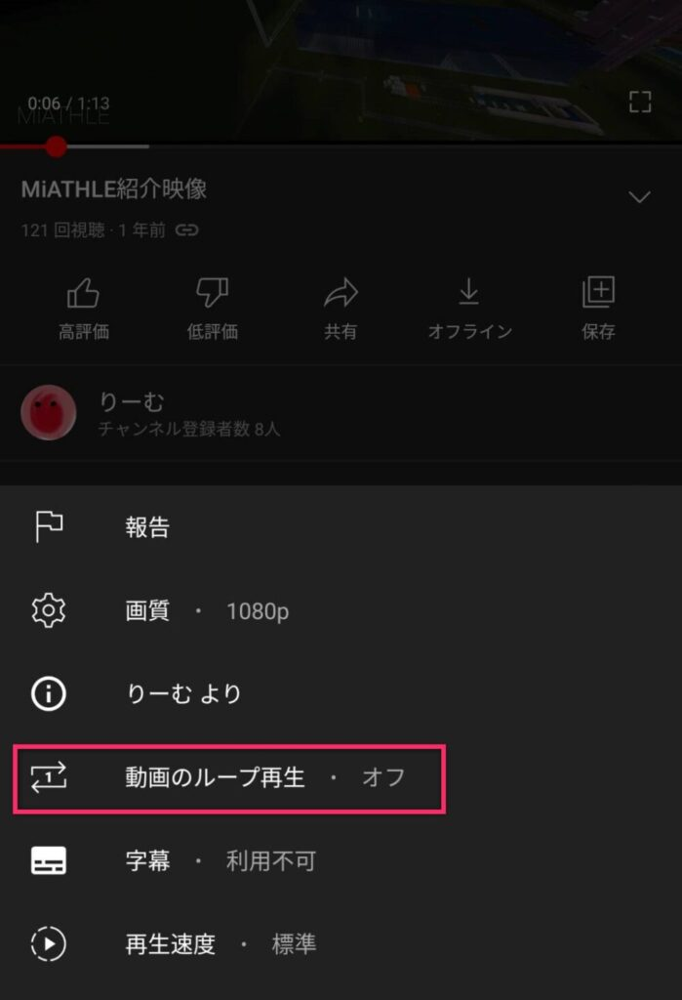
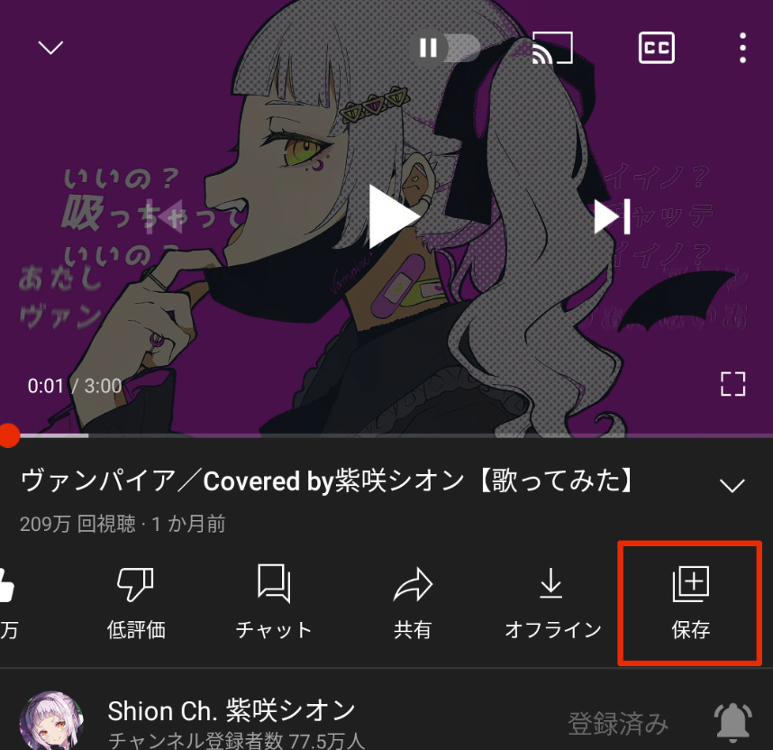
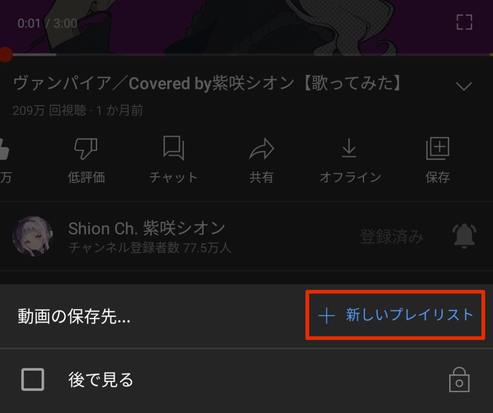
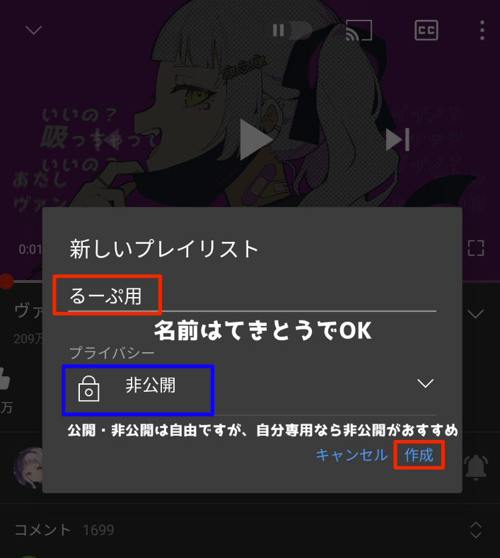
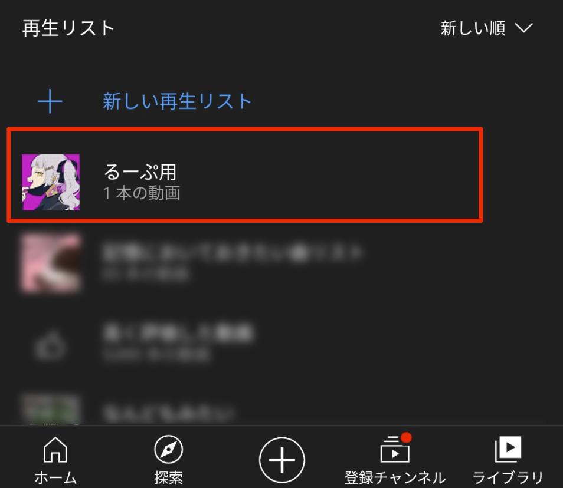
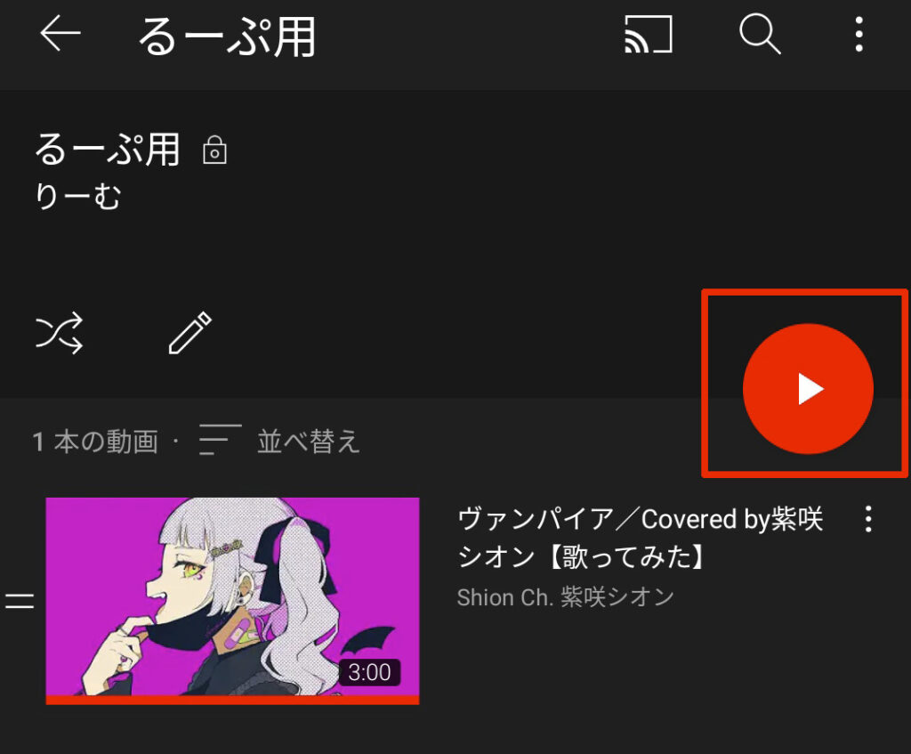
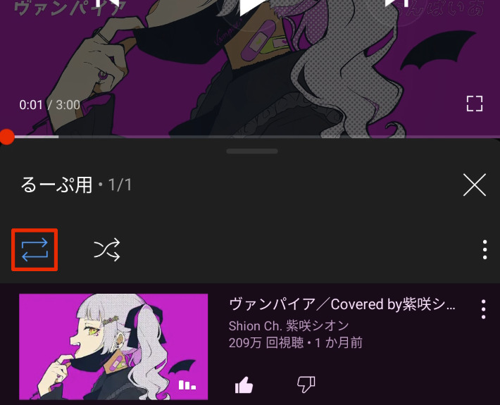

YouTubeでミュージックビデオや歌ってみた動画を作業用BGMとしてループ再生したくなるときはありませんか？

<figure>

<figcaption>

たいようくん

</figcaption>

</figure>

ループとかしなくても1時間耐久動画とか観ればよくね？ｗ

と思う方もいるかもしれませんが、耐久動画は元動画の再生回数にも場合によっては収益にもなりません。好きな動画だからこそ長時間聴きたいと思うんだから元動画に貢献したいですよね！

そこで今回は、YouTubeでループ再生する方法をご紹介します！

## PCでループ再生する方法

<figure>

<figcaption>

出典元の神動画：[https://youtu.be/jso4f52Pl6Y](https://youtu.be/jso4f52Pl6Y)

</figcaption>

</figure>

プレイヤー上にマウスを合わせて「右クリック」→「ループ再生」をクリックするだけ！

## スマホでループ再生する方法

右上の\[ys\_icon name="more-vertical"\]をタップします

するとメニューが出てくるので「動画のループ再生」をタップします

オフからオンに変わったら完了です！

#### 旧バージョンでの方法

**※旧バージョンのYouTubeを使い続けたい場合こちらの方法をつかってください！**

スマホでは正式なループ再生方法がないので、再生リストを使います。

まずはループ再生したい動画を開き「保存」をタップします。

「\[ys\_icon name="plus"\]新しいプレイリスト」をタップします（ループ再生用なのですでに再生リストを作っていても新しく作ってください）

名前やプライバシーを設定して「作成」をタップ

メニューからライブラリをタップすると下の方に再生リストの一覧が表示されるのでそこから先程作成した再生リストをタップしてください

再生ボタンか動画をタップ

再生リスト付きの動画が流れ始めるので、ループのマークをタップ（画像参照）

これでスマホアプリでもループ再生することができます！（正直スマホでも仕様でループ再生できるようにしてほしい...）

## まとめ

ということで今回はYouTubeの動画をループ再生する方法をご紹介しました！ループしまくって作業しまくりましょう！

### 使わせてもらった動画

ThankYou!!

https://youtu.be/jso4f52Pl6Y
